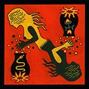

# 🐺 werewolves-simulator

This project simulates Werewolves games without requiring human input. Each player receives a role and a randomly generated personality. During the game, players build suspicions, influence one another, vote during the day, and use their role-specific abilities at night.

The simulator can run either a single detailed game or many games in order to estimate each faction's win rate.

## 🧰 Requirements

Create a virtual environment and install the dependencies:

```bash
python3 -m venv .venv
source .venv/bin/activate
pip install -r requirements.txt
```

## ▶️ Run the simulator

Start the simulation from the repository root:

```bash
python3 main.py
```

The output depends on `N_GAMES` in `config.py`:

- With `N_GAMES = 1`, the simulator prints the history of a single game.
- With `N_GAMES > 1`, it prints a table containing the number of victories and win rate for each faction.

## ⚙️ Configuration

Simulation settings are defined in [`config.py`](config.py).

### 🃏 Role distribution

`ROLE_COUNTS` controls how many cards of each role are included in a game:

```python
ROLE_COUNTS = {
    "thief": 1,
    "cupid": 1,
    "seer": 1,
    "wolf": 3,
    "little_girl": 1,
    "witch": 1,
    "villager": 4,
    "hunter": 1
}
```

Set a role count to `0` to disable that role. When the Thief is enabled, two extra Villager cards are added to the deck before roles are dealt. After the role distribution, the Thief may choose their role from the two undealt cards.

### 🎛️ Simulation parameters

| Parameter | Description |
| --- | --- |
| `N_GAMES` | Number of games to simulate. Use `1` for a detailed game log and a larger value for aggregate statistics. |
| `ALPHA` | Strength of the influence exerted by players during the debate phase. |
| `VOTE_NOISE` | Random variation added to accusation scores when players vote. |
| `GRUDGE_IMMEDIATE_WEIGHT` | Initial weight of a fresh grudge immediately after a player receives a vote. |
| `CO_VOTE_BETA` | Learning rate used to update the co-vote matrix after each day vote. |
| `CO_VOTE_ASSOCIATION_THRESHOLD` | Minimum co-vote link required before a dead Werewolf increases suspicion toward a living player. |
| `CO_VOTE_ASSOCIATION_WEIGHT` | Strength of the suspicion increase caused by association with a revealed dead Werewolf. |
| `CONVINCE_ROLE_VALUE_WEIGHT` | Strength of the convince update applied to vote intention leaders after a village elimination. |
| `SUSPICION_ROLE_VALUE_WEIGHT` | Strength of the suspicion update applied to final voters after a village elimination. |
| `HUNTER_SHOT_THRESHOLD` | Minimum suspicion score required for the Hunter to shoot another player when dying. |
| `WITCH_KILL_THRESHOLD` | Minimum suspicion score required for the Witch to use her death potion. |
| `USE_SHERIFF` | Enables the sheriff election mechanic. Set to `0` to disable it, or `1` to elect a sheriff on the first day. |
| `SEED` | Reserved random seed setting. It is currently declared but not applied by the simulator. |

## 🎭 Roles

| Player card | Faction | Role |
| --- | --- | --- |
|  | Villagers | **Villager**: Their objective is to eliminate every Werewolf. They have no special power and must rely solely on their insight and powers of persuasion. |
|  | Werewolves | **Werewolf**: Their objective is to eliminate every innocent player, meaning anyone who is not a Werewolf. Each night, the Werewolves choose a victim to eliminate. |
|  | Villagers | **Seer**: Her objective is to eliminate every Werewolf. Each night, she may inspect a player and discover their true identity. |
|  | Villagers | **Little Girl**: Her objective is to eliminate every Werewolf. Each night, she may spy on the Werewolves. |
|  | Villagers | **Witch**: Her objective is to eliminate every Werewolf. She has two potions: a life potion that can save the Werewolves' victim and a death potion that can eliminate another player. |
|  | Villagers | **Hunter**: Their objective is to eliminate every Werewolf. When they die, they may eliminate another player with their final bullet. |
|  | Villagers | **Cupid**: Their objective is to eliminate every Werewolf. At the beginning of the game, they create a couple. The two lovers must survive together: if one dies, the other dies of grief. |
|  | Variable | **Thief**: Their objective is not fixed. At the beginning of the game, they may choose their role from the two cards that were not dealt. |
|  | Special mechanic | **Sheriff**: If enabled, the village elects a sheriff on the first day before the first elimination vote. The sheriff keeps their original role, and their vote counts double during each elimination vote. In case of a tie, the sheriff decides which tied player is eliminated. |

## 🗳️ Voting and behavior model

The simulator focuses mainly on voting dynamics. Each player has two psychological traits generated at the beginning of the game:

$$C \sim \mathcal{N}(0, 1)$$

$$P \sim \mathrm{Beta}(2, 3)$$

where:
* $C$ is the player's persuasion score (`convince`) ;
* $P$ is their paranoia score (`paranoia`), used to model how strongly they remember previous votes against them.

### Debate influence

During the day, players first announce an intended target. Each speaker then influences the other players' suspicion toward that target:

$$I = (C_{speaker} - C_{target}) \times \alpha$$

The resulting influence is added to the listener's suspicion matrix:

$$S_{new} = \max(0, \min(1, S_{old} + I))$$

### Grudge memory

Players also remember who voted against them. This creates a grudge score that decays over time, so recent attacks matter more than old ones:

$$G = \min\left(1,\sum_{t \in T} P \times D(t)\right)$$

where:

$$
D(t)=
\begin{cases}
W_g & \text{for a fresh vote},\\
0.5^{t_{current}-t} & \text{for a previous vote}.
\end{cases}
$$

Here, $W_g$ is `GRUDGE_IMMEDIATE_WEIGHT`.

This gives immediate weight to a fresh vote, allowing it to influence decisions such as the Hunter's revenge shot. Older grudges naturally fade over time.

### Co-vote association

The simulator also tracks how often pairs of players vote for the same target. This co-vote score is updated using an exponential moving average:

$$C = (1-\beta)C + \beta M$$

where:
* $M=1$ if both players voted for the same target ;
* $M=0$ otherwise.

When a Werewolf dies and their role is revealed, players who frequently voted alongside that Werewolf become more suspicious to the rest of the village. The suspicion update is:

$$
S = \max(0, \min(1, S + (C - T)W))
$$

where:
* $T$ is the association threshold ;
* $W$ is the association weight.

This association effect is applied only when the dead player is a Werewolf. By contrast, the death of a Villager has no effect on the suspicion associated with players who frequently voted alongside them.

### Final vote

The final accusation score combines rational suspicion and emotional grudge:

$$A = \max(0, \min(1, S + G))$$

When voting, the simulator adds a small amount of randomness to avoid fully deterministic decisions:

$$V = A + \epsilon \times N$$

where:
* $N$ is `VOTE_NOISE` ;
* $\epsilon$ is a random value between $0$ and $1$.

Each player votes for the alive candidate with the highest accusation score. The player with the most votes is eliminated.

> [!NOTE]
> Special roles can also influence this model by introducing a notion of certainty. Unlike regular players, they can obtain reliable information that directly affects their voting behavior. For example, the Seer can lock a suspicion value after discovering a player's role.

### Role reveal effects

When the village eliminates a player, that player's role is revealed and produces a character value:

$$
R = V_{role} + V_{sheriff}
$$

where:
* $V_{role}$ is the eliminated player's role value ;
* $V_{sheriff}$ is added only if the eliminated player was the Sheriff.

The players who announced the eliminated player during the intention phase are treated as accusation leaders. Their `convince` changes according to the revealed value:

$$
C_{new} = C_{old} - R \times W_c
$$

where $W_c$ is `CONVINCE_ROLE_VALUE_WEIGHT`.

This means leaders gain convince when the village eliminates a Werewolf, because Werewolves have a negative role value. By contrast, they lose convince when the village eliminates an innocent role, with stronger losses for more valuable roles.

The final voters are also judged by the rest of the village. Every living observer updates their suspicion toward each player who voted for the eliminated target:

$$
S_{new} = \max(0, \min(1, S_{old} + R \times W_s))
$$

where $W_s$ is `SUSPICION_ROLE_VALUE_WEIGHT`.

This means voting to eliminate an innocent player makes a voter more suspicious, while voting to eliminate a Werewolf makes them less suspicious.

## 📄 License

This project is licensed under the terms of the [`LICENSE`](LICENSE) file.
